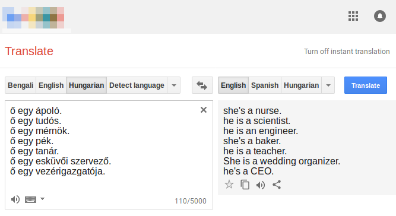
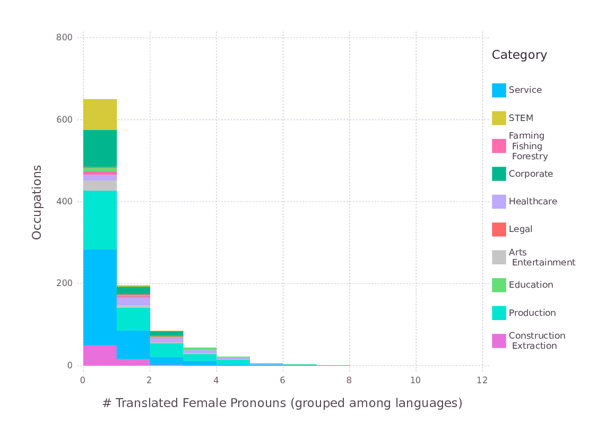
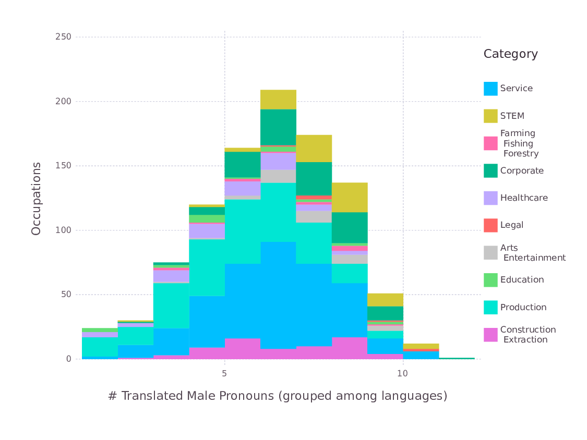
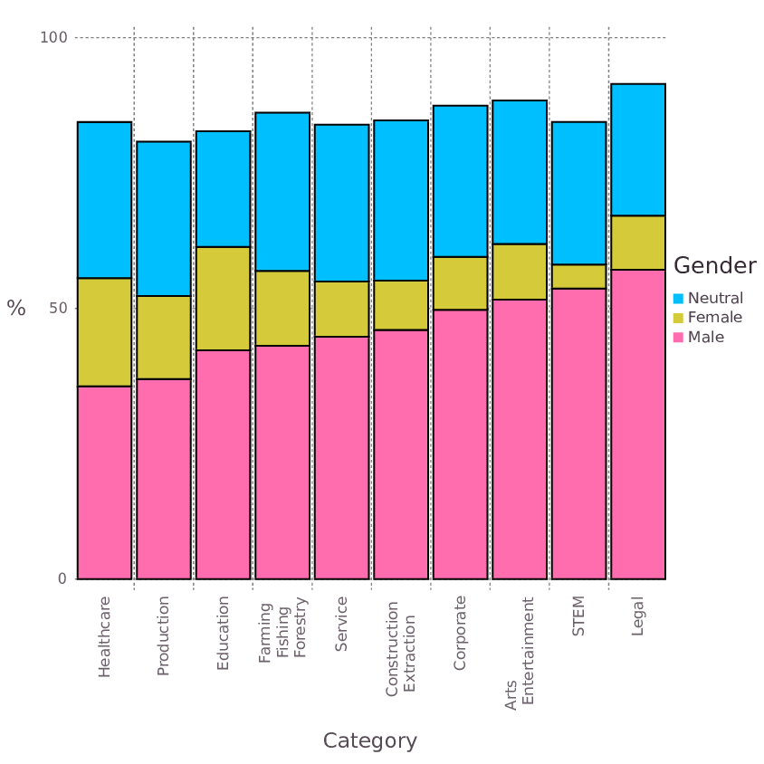
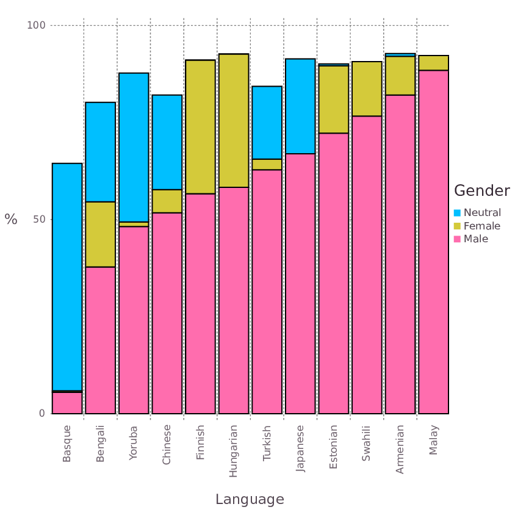

Recentemente temos observado uma preocupação crescente na academia, na pesquisa industrial e na mídia sobre o fenômeno conhecido como *machine bias* ou "viés de máquina", que se refere ao processo pelo qual modelos estatísticos treináveis -- isto é, ferramentas de inteligência artificial que aprendem com exemplos de treinamento -- passam a exibir vieses controversos após o treinamento, particularmente vieses detrimentais para alguma minoria como por exemplo viés de gênero ou de raça. Recentemente múltiplas ferramentas foram acusadas de apresentar esse tipo de viés, por exemplo preditores de reincidência criminal no sistema prisional Americano que se sugere terem viés étnico (predizendo reincidência criminal de pessoas negras com maior probabilidade do que caucasianos), a polêmica do sistema de reconhecimento facial do Iphone X que se sugeriu ser incapaz de distinguir entre duas pessoas asiáticas, e o caso infame do sistema de classificação de imagens do Google photos, que classificava pessoas negras como gorilas. Mais recentemente (2017), uma imagem que sugeria viés de gênero na ferramenta de tradução automática Google Translate viralizou nas mídias sociais. A imagem mostrava um conjunto de profissões traduzido da Língua húngara para o Inglês, no qual ocupações como Enfermeiro(a) e Padeiro(a) eram traduzidas com pronome feminino e ocupações como Engenheiro(a) e CEO eram traduzidas com pronome masculino.

Acreditamos que esse tipo de viés pode ser estudado a partir de uma abordagem sistemática e quantitativa. Por isso, levantamos um conjunto abrangente de profissões do U.S. Bureau of Labor Statistics (BLS) e o usamos para construir sentenças em construções do tipo "Ele(a) é um(a) Engenheiro(a)/Enfermeiro(a)/Médico(a)" em 12 linguagens diferentes que admitem gênero neutro (isto é, linguagens que admitem pronomes que não indicam gênero masculino ou feminino especificamente) -- Malaio, Estoniano, Finlandês, a Língua húngara, Armênio, a Língua bengali, Japonês, a Língua turca, a Língua iorubá, a Língua suaíli, a Língua basca e Chinês. Frases no template descrito acima foram produzidas para um total de 1019 profissões agrupadas num total de 22 categorias (Educação, Negócios, Transporte, etc.).

| Família de Linguagem | Linguagem             | Frases têm marcadores masculino/feminino | Testada     |
|:---------------:|----------------------|----------------------------------|------------|
|   Austronésicas  | Malaio                | ❌                           | ✔ |
|      Urálicas     | Estoniano             | ❌                           | ✔ |
|                 | Finlandês              | ❌                           | ✔ |
|                 | Língua húngara            | ❌                           | ✔ |
|  Indo-Européias  | Armênio             | ❌                           | ✔ |
|                 | Língua bengali              | O                           | ✔ |
|                 | Inglês              | ✔                           | ❌ |
|                 | *Língua persa* | ❌                           | ✔ |
|                 | *Língua nepalesa*  | O                           | ✔ |
|     Japônicas     | Japonês             | ❌                           | ✔ |
|     Coreânicas    | *Coreano*  | ✔                           | ❌ |
|      Turcas     | Língua turca              | ❌                           | ✔ |
|   Níger-Congo   | Língua Iorubá               | ❌                           | ✔ |
|                 | Língua Suaíli              | ❌                           | ✔ |
|     Isoladas     | Língua basca               | ❌                           | ✔ |
|   Sino-Tibetanas  | Chinês              | O                           | ✔ |
{: .tablelines}
Tabela de Linguagens. Linguagens com ❌/✔ na última coluna foram descartadas/aceitas para teste. A maior parte das linguagens descartadas o foram por não admitirem pronome de gênero neutro, porém as Línguas persa, nepalesa e coreana (em itálico) foram descartadas por outros motivos.

| Categoria                                       | Grupo                        | # Ocupações | Participação Feminina |
|------------------------------------------------|------------------------------|----------------|----------------------|
| Education, training, and library               | Education                    | 22           | 73.0%             |
| Business and financial operations              | Corporate                    | 46           | 54.0%             |
| Office and administrative support              | Service                      | 87           | 72.2%             |
| Healthcare support                             | Healthcare                   | 16           | 87.1%             |
| Management                                     | Corporate                    | 46           | 39.8%             |
| Installation, maintenance, and repair          | Service                      | 91           | 4.0%              |
| Healthcare practitioners and technical         | Healthcare                   | 43           | 75.0%             |
| Community and social service                   | Service                      | 14           | 66.1%             |
| Sales and related                              | Corporate                    | 28           | 49.1%             |
| Production                                     | Production                   | 264          | 28.9%             |
| Architecture and engineering                   | STEM                         | 29           | 16.2%             |
| Life, physical, and social science             | STEM                         | 34           | 47.4%             |
| Transportation and material moving             | Service                      | 70           | 17.3%             |
| Arts, design, entertainment, sports, and media | Arts / Entertainment         | 37           | 46.9%             |
| Legal                                          | Legal                        | 7            | 52.8%             |
| Protective Service                             | Service                      | 28           | 22.3%             |
| Food preparation and serving related           | Service                      | 17           | 53.8%             |
| Farming, fishing, and forestry                 | Farming / Fishing / Forestry | 13           | 23.4%             |
| Computer and mathematical                      | STEM                         | 16           | 25.5%             |
| Personal care and service                      | Service                      | 33           | 76.1%             |
| Construction and extraction                    | Construction / Extraction    | 68           | 3.0%              |
| Building and grounds cleaning and maintenance  | Service                      | 10           | 40.7%             |
| Total                                          | -                            | 1019         | 41.3%             |
{: .tablelines}
Tabela de ocupações obtidas do U.S. Bureau of Labor Statistics (https://www.bls.gov/cps/cpsaat11.htm), agrupadas por categoria. Nós agrupamos as categorias em grupos de menor granularidade.

|  Linguagem |                                         Template de Sentença para Ocupações                                         |                                         Template de Sentença para Adjetivos                                         |
|:---------:|:------------------------------------------------------------------------------------------------------------:|:-----------------------------------------------------------------------------------------------------------:|
|   Malaio   |                                    dia adalah < ocupação >                                   |                                       dia < adjetivo >                                       |
|  Estoniano |                                      ta on < ocupação >                                      |                                      ta on < adjetivo >                                      |
|  Finlandês  |                                      hän on < ocupação >                                     |                                      hän on < adjetivo >                                     |
| Língua húngara |                                      ő egy < ocupação >                                      |                                        ő < adjetivo >                                        |
|  Armeniano |                                       na < ocupação > e                                      |                                       na < adjetivo > e                                      |
|  Língua Bengali  |                                    Ē ēkajana < ocupação >                                    |                                        Ē < adjetivo >                                        |
|           |                                   Yini ēkajana < ocupação >                                  |                                       Yini < adjetivo >                                      |
|           |                                    Ō ēkajana < ocupação >                                    |                                        Ō < adjetivo >                                        |
|           |                                   Uni ēkajana < ocupação >                                   |                                       Uni < adjetivo >                                       |
|           |                                    Sē ēkajana < ocupação >                                   |                                        Sē < adjetivo >                                       |
|           |                                   Tini ēkajana < ocupação >                                  |                                       Tini < adjetivo >                                      |
|  Japonês | あの人は < ocupação > です | あの人は < adjetivo > です |
|  Língua turca  |                                      o bir < ocupação >                                      |                                        o < adjetivo >                                        |
|   Língua Iorubá  |                                       o jẹ < ocupação >                                      |                                       o jẹ < adjetivo >                                      |
|   Língua basca  |                                      < ocupação > bat da                                     |                                        < adjetivo > da                                       |
|  Língua suaíli  |                                     yeye ni < ocupação >                                     |                                     yeye ni < adjetivo >                                     |
|  Chinês  |                                      ta shi < ocupação >                                     |                                      ta hen < adjetivo >                                     |
{: .tablelines}
Tabela de templates de tradução Inglês -> Idioma de gênero neutro.

Ao coletar estatísticas a respeito da frequência de tradução com pronomes femininos, masculinos ou neutros no conjunto de profissões examinado, observamos que o Google Translate apresenta, em média, um viés para traduções masculinas, com pronomes masculinos aparecendo em 59% das traduções (vs 16% de femininos, 12% de neutros e 13% de erros de tradução). Na prática, o percentual de pronomes masculinos dentro das traduções válidas (isto é, sem erros) é de 68%, e a razão de pronomes masculinos por pronome feminino é de 5 para 1. Importante ressaltar também que o percentual de traduções com gênero neutro é maior do que o percentual feminino.

|                    Categoria                    | Feminino (\%) | Masculino (\%) | Neutro (\%) |
|:----------------------------------------------:|:-------------:|:-----------:|:--------------:|
|        Office and administrative support       |     11.015    |    58.812   |     16.954     |
|          Architecture and engineering          |     2.299     |    72.701   |      10.92     |
|         Farming, fishing, and forestry         |     12.179    |    62.179   |     14.744     |
|                   Management                   |     11.232    |    66.667   |     12.681     |
|          Community and social service          |     20.238    |     62.5    |     10.119     |
|               Healthcare support               |      25.0     |    43.75    |     17.188     |
|                Sales and related               |     8.929     |    62.202   |     16.964     |
|      Installation, maintenance, and repair     |      5.22     |    58.333   |     17.125     |
|       Transportation and material moving       |      8.81     |    62.976   |      17.5      |
|                      Legal                     |     11.905    |    72.619   |     10.714     |
|        Business and financial operations       |     7.065     |    67.935   |      15.58     |
|       Life, physical, and social science       |     5.882     |    73.284   |     10.049     |
| Arts, design, entertainment, sports, and media |     10.36     |    67.342   |     11.486     |
|        Education, training, and library        |     23.485    |    53.03    |      9.091     |
|  Building and grounds cleaning and maintenance |      12.5     |    68.333   |     11.667     |
|            Personal care and service           |     18.939    |    49.747   |     18.434     |
|     Healthcare practitioners and technical     |     22.674    |    51.744   |     15.116     |
|                   Production                   |     14.331    |    51.199   |     18.245     |
|            Computer and mathematical           |     4.167     |    66.146   |     14.062     |
|           Construction and extraction          |     8.578     |    61.887   |     17.525     |
|               Protective service               |     8.631     |    65.179   |      12.5      |
|      Food preparation and serving related      |     21.078    |    58.333   |     17.647     |
|                      Total                     |     11.76     |    58.93    |     15.939     |
{: .tablelines}
Frequências de tradução com pronomes Femininos, Masculinos e Neutros do Google Translate no conjunto de profissões, estratificados por categoria.

|                    Grupo                    | Feminino (\%) | Masculino (\%) | Neutro (\%) |
|:----------------------------:|:-------------:|:-----------:|:--------------:|
|            Service           |      10.5     |    59.548   |     16.476     |
|             STEM             |     4.219     |    71.624   |     11.181     |
| Farming / Fishing / Forestry |     12.179    |    62.179   |     14.744     |
|           Corporate          |     9.167     |    66.042   |     14.861     |
|          Healthcare          |     23.305    |    49.576   |     15.537     |
|             Legal            |     11.905    |    72.619   |     10.714     |
|     Arts / Entertainment     |     10.36     |    67.342   |     11.486     |
|           Education          |     23.485    |    53.03    |      9.091     |
|          Production          |     14.331    |    51.199   |     18.245     |
|   Construction / Extraction  |     8.578     |    61.887   |     17.525     |
|             Total            |     11.76     |    58.93    |     15.939     |
{: .tablelines}
Frequências de tradução com pronomes Femininos, Masculinos e Neutros do Google Translate no conjunto de profissões, estratificados por grupo (STEM = Ciência, Tecnologia, Engenharia e Matemática).

Histograma do número de linguagens de gênero neutro cujas traduções resultam em pronomes femininos, agrupados por categoria. Percebe-se que a maior parte das traduções se concentra no 0, ou seja, na maior parte das vezes nenhuma das linguagens testadas produz tradução com gênero feminino. Percebe-se ainda que categorias estereotípicas como STEM (Ciência, Tecnologia, Engenharia e Matemática) esse fenômeno é mais pronunciado.

Em contraste com o histograma anterior, a distribuição de pronomes masculinos se concentra próximo do 7, ou seja, a expectativa é de que muito mais linguagens, em média, produzam traduções com pronomes masculinos. Podemos observar que profissões STEM se localizam do lado direito do histograma, sugerindo que a sua tendência de tradução com pronome masculino é pronunciada.

Também podemos observar o quanto cada grupo contribui para a frequência total de tradução masculina, feminina e neutra. Nota-se que profissões dos ramos Legal, STEM e Entretenimento são (nessa ordem) as que mais produzem traduções de gênero masculino, enquanto as que menos produzem são (nessa ordem) as profissões dos ramos de Saúde, Produção e Educação.

Podemos ainda observar as frequências de tradução estratificadas por linguagem, ao que observamos por exemplo que o Malaio é o idioma que mais traduz com pronomes masculinos enquanto a Língua basca, no outro extremo, traduz preferencialmente com gênero neutro.

Devemos considerar a possibilidade de que as frequências de tradução menores com pronomes femininos traduzam de alguma maneira uma baixa participação feminina nos respectivos cargos. Como tínhamos acesso às frequências de participação feminina, fomos capazes de investigar essa questão de maneira estatística, ao que concluímos que a frequência de tradução feminina do Google Translate subestima a frequência de ocupação feminina no cargo de trabalho correspondente. Com isso, concluímos que o Google Translate em específico sofre de um problema de viés de gênero, que provavelmente é um fenômeno que está implícito nos dados de treinamento -- como a ferramenta é treinada com exemplos reais de tradução, possivelmente acaba aprendendo relações de gênero que estão impressas no nosso modo de falar e escrever a respeito de mulheres no mercado de trabalho. Acreditamos que esse trabalho oferece uma janela de oportunidade para que os pesquisadores de inteligência artificial possam refletir sobre os impactos sociais das tecnologias desenvolvidas e trabalhar no sentido de minimizar os seus efeitos negativos. Estamos otimistas a respeito da possibilidade de se obter resultados não enviesados no campo de tradução automática com relativamente pouco esforço e custos marginais à peformance dos métodos atuais, pois técnicas para remover vieses já estão presentes na literatura científica.
